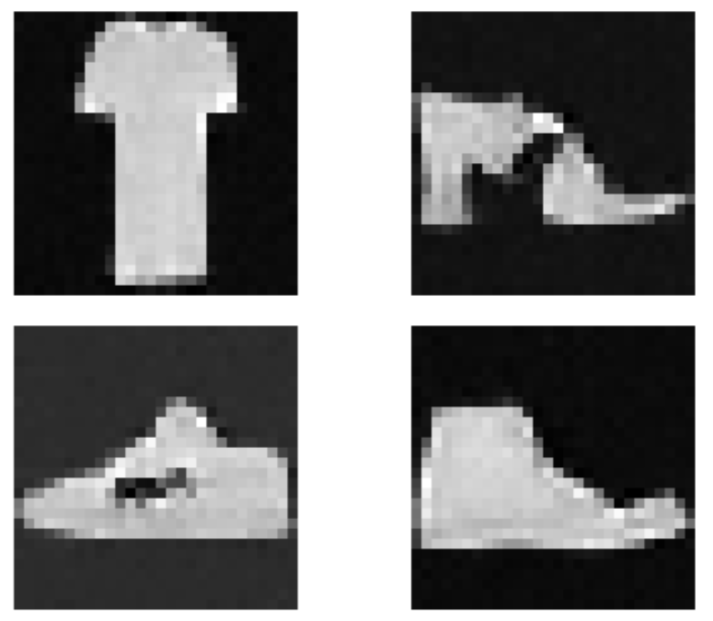

# Personnal model implementations catalogue

**Store implemented models, test scripts and ideas.**

## Diffusion

### Implement Denoising Diffusion Probabilitic Model (DDPM)
- jax and pytorch implementation with varriants
- get familiar with lightning, tensorboard
- [Ho, Jonathan, Ajay Jain, and Pieter Abbeel. "Denoising diffusion probabilistic models." Advances in neural information processing systems 33 (2020): 6840-6851.](https://proceedings.neurips.cc/paper/2020/file/4c5bcfec8584af0d967f1ab10179ca4b-Paper.pdf)

- 

### Test with other celebrated models
- [Rombach, Robin, et al. "High-resolution image synthesis with latent diffusion models." Proceedings of the IEEE/CVF conference on computer vision and pattern recognition. 2022.](https://openaccess.thecvf.com/content/CVPR2022/papers/Rombach_High-Resolution_Image_Synthesis_With_Latent_Diffusion_Models_CVPR_2022_paper.pdf)
    - HuggingFace reference : https://huggingface.co/stabilityai/stable-diffusion-2-1
- [Guo, Yuwei, et al. "Animatediff: Animate your personalized text-to-image diffusion models without specific tuning." arXiv preprint arXiv:2307.04725 (2023).](https://arxiv.org/pdf/2307.04725) 
    - HuggingFace reference : https://huggingface.co/guoyww/animatediff-motion-adapter-v1-5-2

## Path Development
- Leverage path development inside models
- implement a jax version

