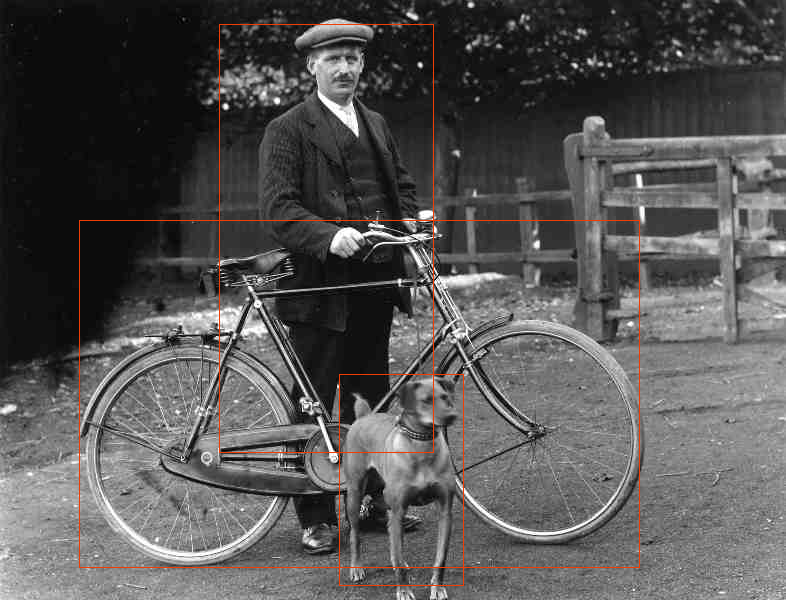

# Burn YOLOX test

Model and script taken from [here](https://github.com/tracel-ai/models).

Used corrected source : 
```code
diff --git a/yolox-burn/src/model/bottleneck.rs b/yolox-burn/src/model/bottleneck.rs
index 1b738cd..b6f8d18 100644
--- a/yolox-burn/src/model/bottleneck.rs
+++ b/yolox-burn/src/model/bottleneck.rs
@@ -111,6 +111,7 @@ impl SppBottleneckConfig {
             .map(|k| {
                 let pad = k / 2;
                 MaxPool2dConfig::new([k, k])
+                    .with_strides([1, 1])
                     .with_padding(burn::nn::PaddingConfig2d::Explicit(pad, pad))
             })
             .collect();

```

**Bounding boxes result :**



