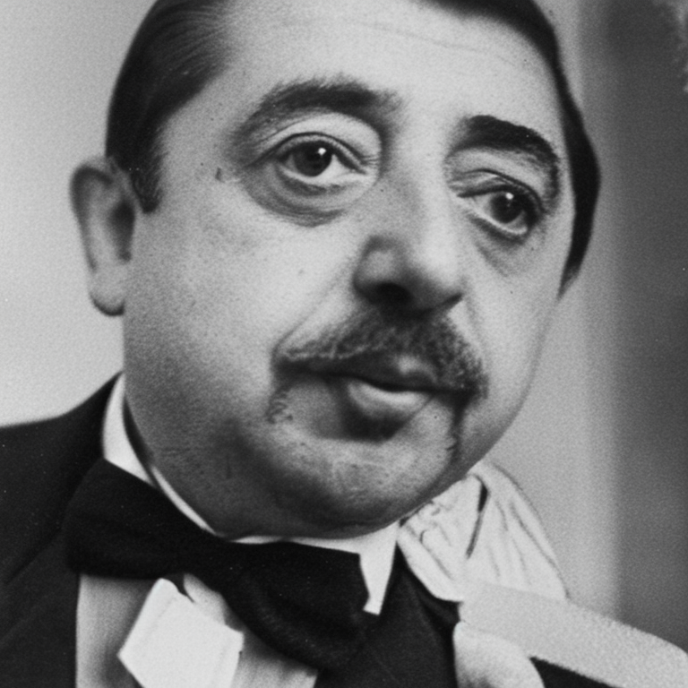

# Generative models

## Implementations

> [!NOTE]
> Each subfolder contains environment configuration

End-to-end implementation :
- Probabilitstic PCA
- Variational Autoencoder
- Denoising Diffusion Probabilistic model
- Scaled Dot Product Attention (JAX/Flax implementation with numerically stable softmax)

Snippets :
- scaled dot product attention block

## Scripts

> [!NOTE]
> If you don't use [uv](https://docs.astral.sh/uv/) requirements in *test_requirements.txt*

**Animate Diff**

```bash
uv run scripts/test_animate_diff.py --prompt "sea-side, beach, high resolution, pine trees, waves"
```


**Stable Diffusion**

```bash
uv run scripts/test_stable_diffusion.py --prompt "Jacques Prévert wearing a bow tie"
```

> [!WARNING]
> If UTF-8 is not supported by default, one can specify the following variables :
> ```bash
> export LC_ALL=en_UK.UTF-8
> export LANG=en_UK.UTF-8
> export LANGUAGE=en_UK.UTF-8
> ```


**Example results**




**TODO**

- [ ] Update consistency models tests
- [ ] [Burn](https://burn.dev/) POC


