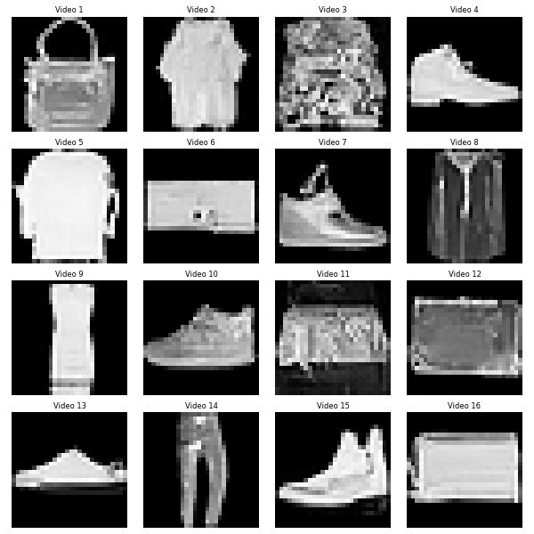

# Denoising Diffusion Probabilistic model


> [!NOTE]
> A large part of the improvements are inspired from this implementation :
> - https://github.com/lucidrains/denoising-diffusion-pytorch

**Run**

```shell
python -m run_lit_unet
```

**Sample**




**Derivation of the sampling process**

The notations are taken from :
-  [Ho, Jonathan, Ajay Jain, and Pieter Abbeel. "Denoising diffusion probabilistic models." Advances in neural information processing systems 33 (2020): 6840-6851.](https://proceedings.neurips.cc/paper/2020/file/4c5bcfec8584af0d967f1ab10179ca4b-Paper.pdf)

With the Markov chain defined as :

$$ 
x_{t+1} = \sqrt{1-\beta_{t+1}} x_t + \sqrt{\beta_{t+1}}\epsilon_{t+1}
$$

ie the law of the noising process being :

$$
q(x_t | x_{t-1}) = \mathcal{N}(\sqrt{1-\beta_{t+1}} x_{t-1}, \beta_t I)
$$

The noising process has the analytical form for any time step :

$$
q(x_t | x_{0}) = \mathcal{N}(\sqrt{\bar{\alpha_t}} x_{0}, \sqrt{1 - \bar{\alpha_t}} I)
$$

To sample an image :
- Sample $x_T \sim \mathcal{N}(0, 1) $
- For $t \in T \dots 1 $ :
    - $\tilde{x_0} = \frac{1}{\sqrt{\bar{\alpha_t}}} x_0 - \sqrt{ \frac{1}{\bar{\alpha_t}} - 1} \times \tilde{\epsilon}(x_t, t)$
    - apply variational inference to get $q(x_{t-1} | x_t, x_0) \sim \mathcal{N} (\mu_t, \sigma^2_tI)$

$$
\begin{align*}
q(x\_{t-1} | x_t, x_0) & = \frac{q(x_t | x\_{t-1}, x_0) \times q(x\_{t-1}| x\_0)}{q(x\_t | x\_0)} \\
& \propto \exp \left[
    \frac{(x_t - \sqrt{\bar{\alpha}\_t} x_0 )^2}{2(1-\bar{\alpha}\_t)}
    - \frac{(x\_{t-1} - \sqrt{\bar{\alpha}\_{t-1}} x\_0 )^2}{2(1-\bar{\alpha}\_{t-1})}
    - \frac{(x\_t - \sqrt{\alpha_t} x\_{t-1} )^2}{2(1-\alpha_t)}
    \right] \\
& \propto \exp
    \left[
        \frac{1}{2} \left( -x\_{t-1}^2 \left(\frac{1}{1-\bar{\alpha}\_{t-1}} + \frac{1}{1 - \alpha_t}\right)
        + 2\left( \frac{\sqrt{\bar{\alpha}\_{t-1}}x_0}{1-\bar{\alpha}\_{t-1}} + \frac{\sqrt{\alpha_t}x_t}{1-\alpha_t} \right)
        + \dots
        \right)
    \right]
\end{align*}
$$

Hence we deduce the posterior mean and variance as in section 2 eq (7):

$$
\begin{cases}
\mu_t(x_t, x_0) = \frac{\beta_t \sqrt{\bar{\alpha}\_{t-1}}}{1 - \bar{\alpha}_t} x_0 + \frac{1 - \bar{\alpha}\_{t-1}}{1 - \bar{\alpha}_t} x_t \\
\sigma^2_t(x_t, x_0) = \frac{\beta_t(1 - \bar{\alpha}\_{t-1})}{1 - \bar{\alpha}\_t}
\end{cases}
$$

TODO :
- [x] try other noise schedules
- [ ] test variants of sampling, and stability from input noise
- [ ] refactor diffusion to class to avoid passing parameters as arguments
- [ ] update simpler variant of Unet
- [ ] update jax unet and optimisation loop
