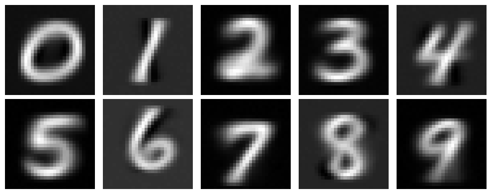

# Probabilitic PCA on MNIST dataset

A simple idea to generative modelling, as mentionned in 
*Bengio, Yoshua, Ian Goodfellow, and Aaron Courville. Deep learning. Vol. 1. Cambridge, MA, USA: MIT press, 2017.* 
is to consider the PCA on some dataset, and to add noise to the decomposed matrix
to generate samples that were not in the training set, 
but that share the same principal components with their respective amplitude.



### References :

```bibtex
@article{tipping1999probabilistic,
  title={Probabilistic principal component analysis},
  author={Tipping, Michael E and Bishop, Christopher M},
  journal={Journal of the Royal Statistical Society Series B: Statistical Methodology},
  volume={61},
  number={3},
  pages={611--622},
  year={1999},
  publisher={Oxford University Press}
}
```

```bibtex
@book{bengio2017deep,
  title={Deep learning},
  author={Bengio, Yoshua and Goodfellow, Ian and Courville, Aaron and others},
  volume={1},
  year={2017},
  publisher={MIT press Cambridge, MA, USA}
}
```
**For the computation of the Singular Value Decomposition :** 

The naive SVD algorithm, pure QR with Householder reflections and bidiagonalisation algorithm are taken from `Trehefen`, 
while the SVD implementation with Givens rotations is from `Golub`.

```bibtex
@book{trefethen2022numerical,
  title={Numerical linear algebra},
  author={Trefethen, Lloyd N and Bau, David},
  year={2022},
  publisher={SIAM}
}
```

```bibtex
@book{golub2013matrix,
  title={Matrix computations},
  author={Golub, Gene H and Van Loan, Charles F},
  year={2013},
  publisher={JHU press}
}
```
