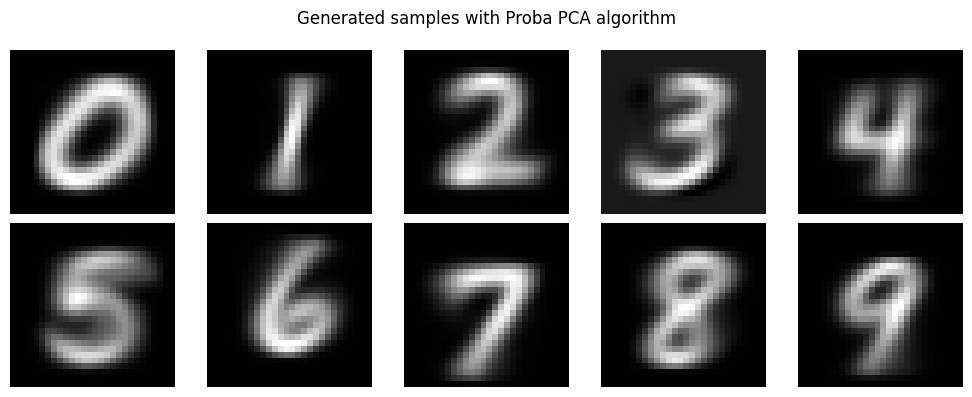

# Probabilitic PCA on MNIST dataset

Principal Components Analysis aims to describe as much variance in a dataset 
with orthogonal combinations of features, 
which is adapted to handle multi-colinearities, 
at the cost of features interpretability.

In
`Bengio, Yoshua, Ian Goodfellow, and Aaron Courville, 2017.`[*](#references), 
the PCA is used to describe the data distribution.
With Gaussian assumption, it generates samples assuming an ellipsoid distribution of the data.

Indeed the covariance matrix of the data can be deduced from PCA.
For instance it can be used as a regularization technique 
to fit a covariance matrix in a Gaussian mixture model.

Extending the probabilistic framework further, PCA was then bestowed with a probabilistic optimisation framework 
and interpretation thereof (`Tipping, 1999`[*](#references)) 
that allows for a fast approximation. 

Probabilistic PCA (PPCA) has other applications like dealing with missing data
and maximum likelihood comparison with other probabilistic models.

**Project Overview :**
- Implement Singular Value Decomposition algorithms :
  - Using the **QR algoritm** on the covariance matrix,
  - Using the **Golub-Kahan algorithm**,
- Implement the **EM algorithm** in the Probabilistic PCA framework,
- Applying the PCA to generate MNIST digits

**Results :**

With first SVD components :


With Probabilistic PCA :



**TODO :**
- [x] Implement MLE estimation of PPCA with EM algorithm
- [ ] Benchmark execution time between naive SVD and Golub-Kahan algorithm


## Using Singular Value Decomposition

The naive SVD algorithm, pure QR with Householder reflections and bidiagonalisation algorithm are taken from `Trehefen`[*](#references), 
while the SVD implementation with Givens rotations is from `Golub`[*](#references).

The bidiagonalisation is computed with full orthogonal matrices, 
that is to say for $A \in \mathbb{R}^{n \times m}$ : 

$$ A = U B V^T $$

where $U\in \mathbb{R}^{n \times n}$ and $V \in \mathbb{R}^{m \times m}$ .

A reduced form can be found, for instance if $m > n$, the matrices would be of the form :

$$
\begin{cases}
U\in \mathbb{R}^{n \times n} \\
A\in \mathbb{R}^{n \times n} \\
V\in \mathbb{R}^{n \times m}
\end{cases}
$$

But doing so, $V$ is not orthogonal anymore.

Decomposing matrices $A$ and $V$ into sub square matrices $\tilde{A}, \tilde{V}$:

$$ 
\begin{cases} 
A = \begin{pmatrix} \tilde{A} & R \end{pmatrix} \\
V = \begin{pmatrix} \tilde{V} & Z \end{pmatrix}
\end{cases}
$$

while applying the normal Golub bidiagonalisation algorithm to $\tilde{A}$ :

$$ 
A = U \begin{pmatrix} \tilde{B} & R \end{pmatrix} 
\begin{pmatrix} \tilde{V}^T \\ Z^T \end{pmatrix} 
$$

and $Z$ can be left to compute at the end by solving the system :

$$
\tilde{B} Z^T = U^T R
$$

where $\tilde{B}$ is square and upper bi-diagonal.

A similar system is solved if $A$ is thin instead of wide, with the same complexity.


## Using the EM algorithm

Using the same notations as in `Tipping`'s paper[*](#references), 
the probabilistic framework being : 

$$
t = W x + \mu + \epsilon
$$

Where $t \in \mathbb{R}^d$ is the observation variable, 
$x \in \mathbb{R}^q$ is the latent one,
with $q \ll d$ and $\epsilon \sim \mathcal{N} (0, \sigma^2)$.

Then the
<span style="color:green">log-likelihood </span>
of the joint observation and latent variables is :

```math
\begin{align*}
\mathcal{L}(x, t) = &\sum \log p(x_i, t_i) \\
 = & -\frac{1}{2} \sum_{i=1}^N \left\{ d \log \sigma^2  + \frac{1}{\sigma^2} (t_i-\mu - Wx_i)^T( t_i - \mu - Wx_i) + x_i^Tx_i \right\} \\
 & -\frac{1}{2} \sum_{i=1}^N \left\{ d \log \sigma^2  + \frac{1}{\sigma^2} \text{tr} \left((t_i-\mu) (t_i-\mu)^T\right) + \frac{1}{\sigma^2}\text{tr} \left( W^T W x_i x_i^T\right) -  \frac{2}{\sigma^2}(t_i-\mu)^TWx_i + x_i^Tx_i \right\} \\
\end{align*}
```

Taking the 
<span style="color:green">expectation step </span> 
(conditionned on $t, W$ and $\sigma^2$) gives :

$$
\mathbb{E} \left\{ \mathcal{L(x, t)} | t, W, \sigma^2 \right\} = -
\sum_{i=1}^N \left\{ \frac{d}{2} \log \sigma^2 + 
\frac{1}{2\sigma^2} \text{tr} \left( (t_i-\mu) (t_i-\mu)^T\right) + 
\frac{1}{2\sigma^2}\text{tr} \left( W^T W x_i x_i^T\right) -  
\frac{1}{\sigma^2}\text{tr} \left( Wx_i(t_i-\mu)^T \right) + 
\frac{1}{2} \text{tr} \left( x_i x_i^T \right)  \right\}
$$

Where "bar" variables represent the empirical mean over samples.

Where expectations are analytic given $x | t$ is gaussian.

Indeed, Bayes forlula giving : 

$$\begin{align*} p(x|t) & = \frac{p(t|x)p(x)}{p(t)} \\
& \propto \exp \left( - \frac{1}{2\sigma^2} \left(x- M^{-1} W^{T}(t-\mu)\right)^T M \left(x- M^{-1} W^{T}(t-\mu)\right) \right)
\end{align*}$$

Shows that $x | t \sim \mathcal{N}\left(M^{-1} W^{T}(t-\mu), \sigma^2 M^{-1} \right)$,
where $M = W^TW + \sigma^2 I$.

### References :

```bibtex
@article{tipping1999probabilistic,
  title={Probabilistic principal component analysis},
  author={Tipping, Michael E and Bishop, Christopher M},
  journal={Journal of the Royal Statistical Society Series B: Statistical Methodology},
  volume={61},
  number={3},
  pages={611--622},
  year={1999},
  publisher={Oxford University Press}
}
```

```bibtex
@book{bengio2017deep,
  title={Deep learning},
  author={Bengio, Yoshua and Goodfellow, Ian and Courville, Aaron and others},
  volume={1},
  year={2017},
  publisher={MIT press Cambridge, MA, USA}
}
```

```bibtex
@book{trefethen2022numerical,
  title={Numerical linear algebra},
  author={Trefethen, Lloyd N and Bau, David},
  year={2022},
  publisher={SIAM}
}
```

```bibtex
@book{golub2013matrix,
  title={Matrix computations},
  author={Golub, Gene H and Van Loan, Charles F},
  year={2013},
  publisher={JHU press}
}
```

**Also read :**

To model heavy-tailed distributions :
```bibtex
@article{collas2021probabilistic,
  title={Probabilistic PCA from heteroscedastic signals: geometric framework and application to clustering},
  author={Collas, Antoine and Bouchard, Florent and Breloy, Arnaud and Ginolhac, Guillaume and Ren, Chengfang and Ovarlez, Jean-Philippe},
  journal={IEEE Transactions on Signal Processing},
  volume={69},
  pages={6546--6560},
  year={2021},
  publisher={IEEE}
}
```

To adapt PCA to response variable : 
```bibtex
@misc{papazoglou2025covariancesupervisedprincipalcomponent,
      title={Covariance Supervised Principal Component Analysis}, 
      author={Theodosios Papazoglou and Guosheng Yin},
      year={2025},
      eprint={2506.19247},
      archivePrefix={arXiv},
      primaryClass={stat.AP},
      url={https://arxiv.org/abs/2506.19247}, 
}
```
