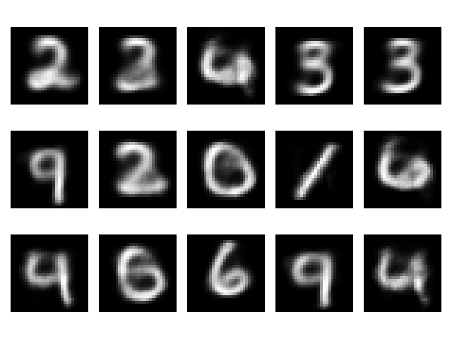

# Variational Autoencoder

Toy implementation of Variational Autoencoder for image generation.

- Visualize the impact of using the Continuous Bernoulli distribution over Bernoulli for the MNIST dataset




TODO :
- [ ] Compare CVAE
- [ ] Scale to other dataset

```bibtex
@article{loaiza2019continuous,
  title={The continuous Bernoulli: fixing a pervasive error in variational autoencoders},
  author={Loaiza-Ganem, Gabriel and Cunningham, John P},
  journal={Advances in Neural Information Processing Systems},
  volume={32},
  year={2019}
}
```