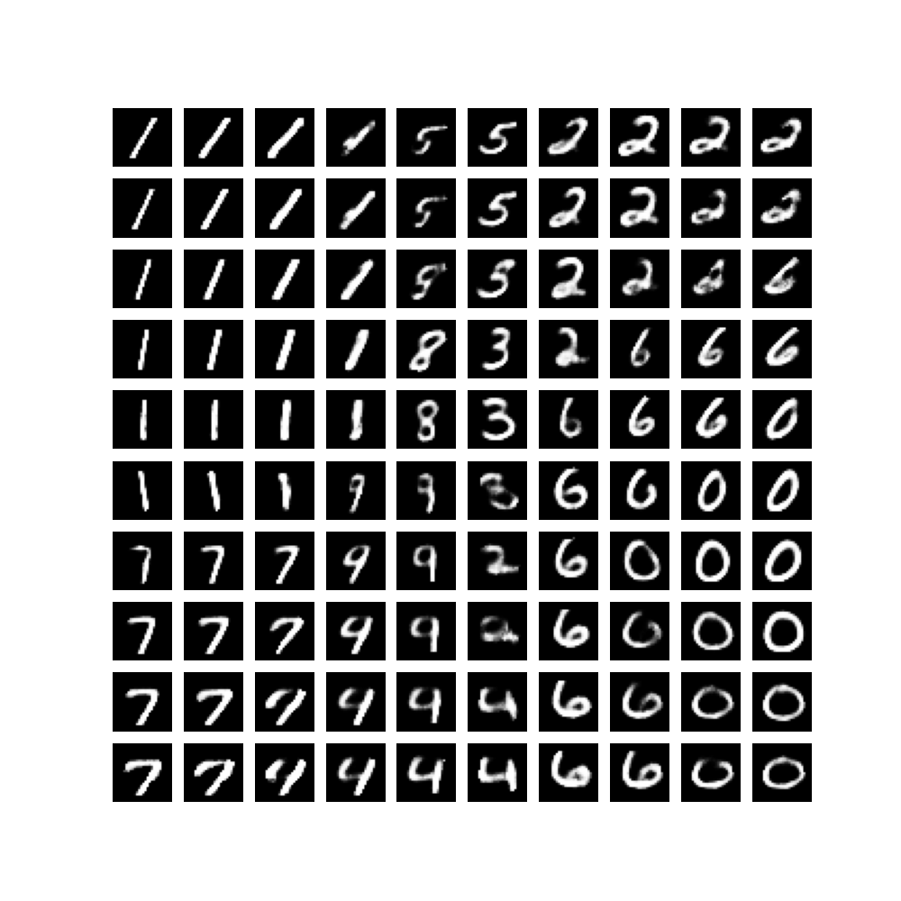

# Variational Autoencoder

Toy implementation of Variational Autoencoder for image generation.

- Visualize the impact of using the Continuous Bernoulli distribution over Bernoulli for the MNIST dataset :

Original :


With Continuous Bernoulli correction :



TODO :
- [x] Compare CVAE
- [x] Scale to other dataset

```bibtex
@article{loaiza2019continuous,
  title={The continuous Bernoulli: fixing a pervasive error in variational autoencoders},
  author={Loaiza-Ganem, Gabriel and Cunningham, John P},
  journal={Advances in Neural Information Processing Systems},
  volume={32},
  year={2019}
}
```

```bibtex
@article{weng2018VAE,
  title   = "From Autoencoder to Beta-VAE",
  author  = "Weng, Lilian",
  journal = "lilianweng.github.io",
  year    = "2018",
  url     = "https://lilianweng.github.io/posts/2018-08-12-vae/"
}
```

