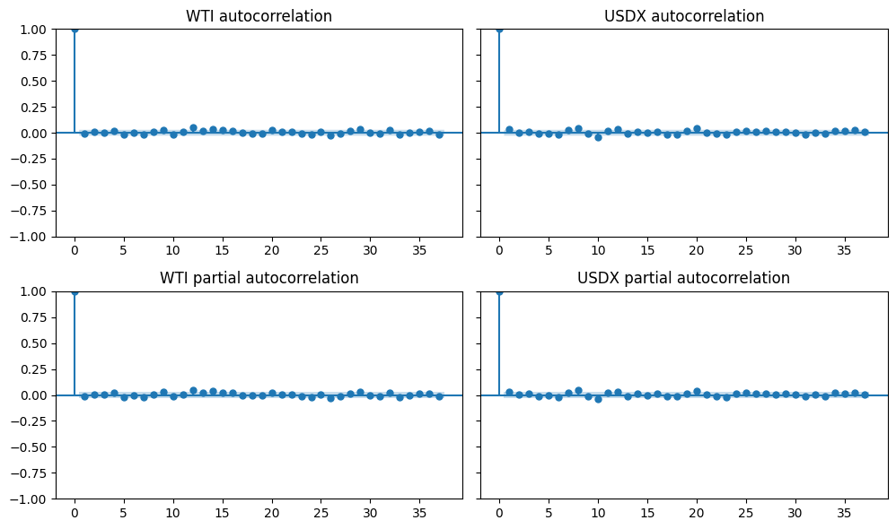

# FICC

Fixed-Income and Commodities related projects and notebooks 
for learning purposes.

**Project list :**
- FX Pricer : pricing algebra in Haskell for simple FX derivatives

**Notebook list :**
- PV01 and DV01 sensitivity comparison : impact of convexity
- WTI and USDX correlation : empirical confirmation

**FX roadmap :**
- [ ] price futures (amend),
- [ ] price quanto,

**Rates roadmap :**

Linear :
- [x] price Forward Rate Agreement (FRA) from replication portfolio,
- [x] price swap from replication,

Non-linear : (with choice of underlying probabilistic model)
- [ ] price swaption,
- [ ] price cap, floor, caplet, floorlet,

Rate models :
- [ ] LMM,
- [ ] SABR,

Short term rate models for $r_t$ :
- [x] Vasicek,
- [x] Vasicek Hull-White extended,
- [ ] G2 ++,
- [ ] CIR ++,
- [ ] CIR Hull-White extended,

**Keep in mind :**
- the foward and backward Kolmogorov equations,
- ergodicity, ergodic theorem,
- the example of Langevin dynamics,

**FX**
- FOR / DOM change of numeraire,
- currency pair duality - GBM assumption,
- trio of currencies and related measures,

**Rates**
- forward probability change of numeraire 

Which rate :
- Simple rate : $C \mapsto C(1 + (T-t) L (t, T)$, like LIBOR-like values are defined,
- Continuous rate : $C \mapsto Ce^{(T-t)R(t, T)}$
- Compounded rate : $C \mapsto C(1 + Y(t, T))^{(T-t)}$

Which modelisation :
- instantaneous forward rate : $f(t,T) = -\partial_T \log B_t(T)$
- short term rate : $r_t = \partial_t B_t(T)$

***

## FX Pricer

Compositional algebra for pricing FX derivatives in Haskell using algebraic data types.

**Features:**
- **Contracts:** Spot, Forward, European Options, Zero-Coupon Bonds
- **Combinators:** Scale, combine, conditional execution with type safety (GADTs)
- **Pricing:** Black-Scholes implementation with discount factors
- **Design:** Build complex derivatives from basic building blocks with compile-time correctness

See `fx_pricer/` for implementation details and examples.

- [ ] Branch [Quantlib](https://github.com/lballabio/QuantLib/tree/master) and compile for numerical verification, 

## PV01 and DV01 for a coupon-paying bond

While : 
$$ 
\text{PV01} = \frac{\partial \text{PV}}{\partial y} \leq 0
$$
values will be considered in absolute term all along.

With a bond paying some coupon on a regular schedule, 
the cash-flows might look like this :

Different assumptions can be made on the term structure,
either it goes upwards or downwards.

The highest sensitivity, for either of the PV01 or DV01 
goes at the highest maturity :

Due to convexity considerations, 
the DV01 will be relatively more important at the tail 
for a downward term structure compared to an upward term structure.

(green is positive and red negative in log scale)

Considering the *flat rate* assumption of PV01,
the former plot also involves that if the term structure is **downward sloping**, then (in absolute terms) :

$$
\text{PV01} \leq \text{DV01}
$$

and vice-versa.

## WTI pressured by dollar index

The notebook confirms the hypothesis that a stronger US dollar pressures crude oil prices.
Key findings:

- **Negative correlation:** -0.488 (p < 0.01) between WTI spot prices and USDX
- **Explainable variance:** ~33% of WTI variance explained by USDX using VAR model + linear projection
- **Idiosyncratic component:** Remaining 67% represents crude-specific price drivers
- **No lead-lag:** Price adjustments occur intraday (no predictive lag between series)
- **Stationarity:** Log differences are stationary, validating time-series modeling approach

Presence of heavy tail for the USD index :

No obvious non-stationarity in the log differenes, then apply stationarity tests to the time series :

No obvious autocorrelation to apply (ARMA, VAR to deduce) :

After projecting the USDX on the WTI : 

which gives an estimator of the idiosyncratic WTI time-series.

The presence of regime changes can be viewed with a scatter plot with time as a color map :

## References :
- Modeles Avances de la Courbe de Taux - Lectures I ... VI, LPSM (M2MO), Zorana Grbac
- https://www.emmi-benchmarks.eu/benchmarks/euribor/rate/
- https://data.ecb.europa.eu/data/data-categories/financial-markets-and-interest-rates/euro-money-market/euro-short-term-rate

