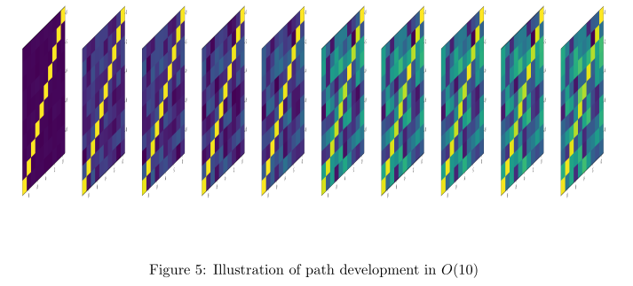
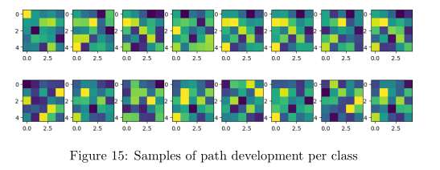
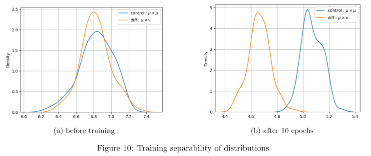

# Non-Commutative Fourier Transform of functions or measures on paths.

Signature methods define transforms from sequential data
to an aggregate of statistics (which is not sequential anymore).

Key valuable properties include naturally handling missing data in sequences, 
and sequences with different sampling frequencies.

Measures on paths can be thought of as either 
the underlying distribution of time-series datasets,
or the flow of a stochastic differential equation.

Combining harmonic analysis tools with the signature transform,
and geometric deep learning for the implementation,
the objective is to characterise measures on paths 
with a set of parameterized statistics,
which can have applications in 
statistical hypothesis testing,
and time-series classification.

## Development of a path to a matrix Lie group

$$
\begin{cases}
dZ_t =  Z_t M_{\theta} (dx_t) \\
Z_0 = I
\end{cases}
$$

The discretised evolution can be visualised in matrix form, 
although only the final state is considered :

Relation between continuous methods (CDE) versus 
interpretation of discretisation as a special case of RNN.

## Characterising measures with path development

One can train the weights of the path development to recognize two different measures.
The following are samples for a two-class problem, 
where a small number of paths form each class is simulated :

Which shows the embeddings still offer some variability.

Then, out-of-sample paths can be classified, 
looking at the scalar products between the in-sample means :

Think of a link with Hilbert-Schmidt independance criterion, 
or distance on the manifold.

***

## Test scripts

- computing developments : need to wheel [DevNet](https://github.com/chataignault/DevNet) before and document for reproducibility
- separation of measures : add mastery script

